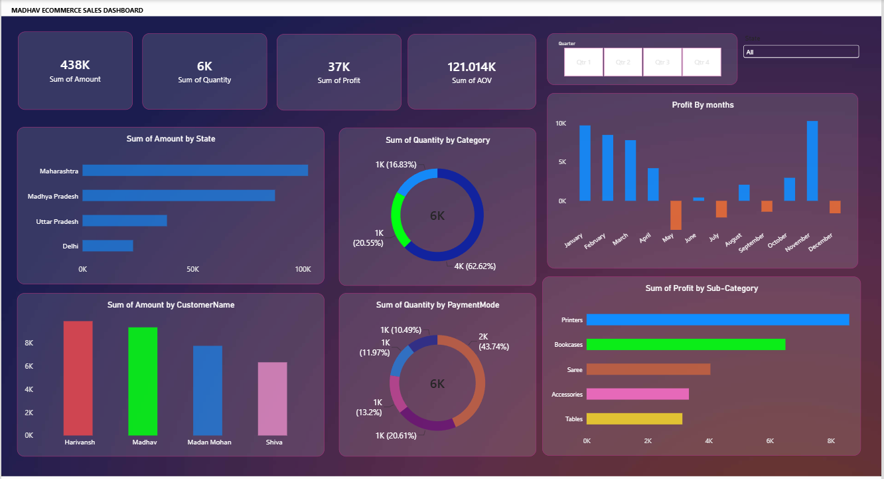
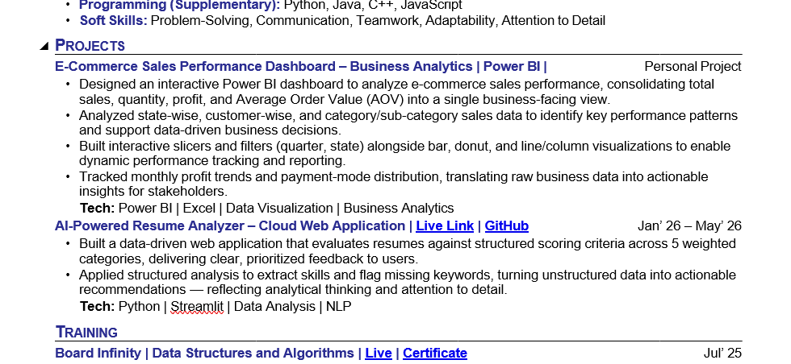
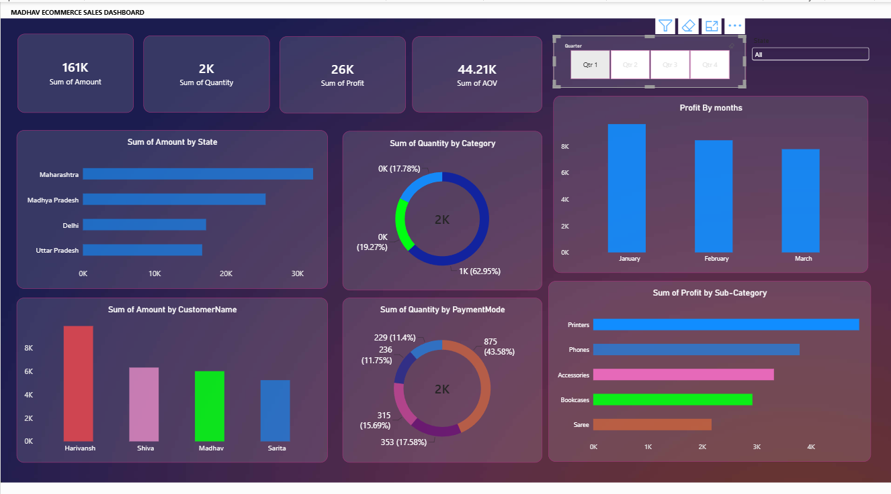

# E-Commerce Sales Performance Dashboard | Power BI

An interactive Power BI dashboard designed to analyze and monitor e-commerce sales performance across different states, customers, categories, payment modes, and time periods.

## Project Overview

This project focuses on analyzing e-commerce sales data and presenting important business performance indicators through an interactive Power BI dashboard.

The dashboard provides a consolidated view of:

- Total Sales
- Total Quantity Sold
- Total Profit
- Average Order Value (AOV)
- State-wise Sales
- Customer-wise Sales
- Category-wise Quantity
- Payment Mode Distribution
- Monthly Profit Trends
- Sub-category Profitability

Interactive filters allow users to explore the data by quarter and state.

## Project Objectives

- Analyze overall e-commerce sales performance.
- Track important business KPIs.
- Identify high-performing states and customers.
- Understand product category and sub-category performance.
- Analyze payment-mode distribution.
- Monitor monthly profit trends.
- Enable interactive exploration of business data.
- Present data in a clear format to support data-driven decision-making.

## Dashboard KPIs

| KPI | Description |
|---|---|
| Total Sales | Total sales amount generated |
| Total Quantity | Total quantity of products sold |
| Total Profit | Overall profit generated |
| AOV | Average Order Value |

These KPIs update dynamically when filters are applied.

## Dashboard Analysis

### Sales by State

Provides a state-wise comparison of sales performance to identify regional differences and high-performing states.

### Sales by Customer

Compares the contribution of different customers to sales and helps identify high-value customers.

### Quantity by Category

Shows how total quantity sold is distributed across product categories.

### Payment Mode Analysis

Provides a breakdown of quantity by payment mode to understand transaction distribution and customer payment preferences.

### Monthly Profit Analysis

Visualizes monthly profit to compare performance over time and identify profitable or less profitable periods.

### Profit by Sub-Category

Compares profit contribution across product sub-categories to identify stronger and weaker product segments.

## Interactive Features

- Quarter filter
- State filter
- Interactive slicers
- Dynamic KPI updates
- Cross-filtering between visuals
- Interactive charts and graphs

## Visualizations Used

- KPI Cards
- Bar Charts
- Column Charts
- Donut Charts
- Slicers
- Interactive Filters

## Tools & Technologies

- Power BI
- Microsoft Excel
- Data Visualization
- Business Analytics
- Interactive Dashboarding

## Project Workflow

Raw Sales Data  
↓  
Data Preparation  
↓  
Data Analysis  
↓  
KPI Creation  
↓  
Power BI Visualizations  
↓  
Interactive Dashboard  
↓  
Business Performance Analysis

## Key Learnings

- Building interactive Power BI dashboards
- Working with business and sales data
- Creating and tracking KPIs
- Analyzing sales and profitability
- Using filters and slicers for dynamic reporting
- Comparing performance across different business dimensions
- Converting raw data into meaningful visual insights
- Presenting business information through data visualization

## Dashboard Preview

### Overall Dashboard



### Quarter Analysis



### Detailed Dashboard View



## Repository Structure

```text
E-Commerce-Sales-PowerBI/
│
├── README.md
│
└── images/
    ├── dashboard-overview.png
    ├── dashboard-quarter.png
    └── dashboard-analysis.png
```

> Add your own `.pbix` file to the repository when you are ready to share the Power BI project file.

## Future Improvements

- Add year-over-year performance analysis.
- Add deeper customer segmentation.
- Add additional KPI calculations.
- Add automated data refresh where applicable.
- Expand the dashboard with additional business performance metrics.

## Author

**Priyanshu Raj**  
B.Tech – Computer Science and Engineering, Lovely Professional University  
GitHub: https://github.com/priyanshu7455
